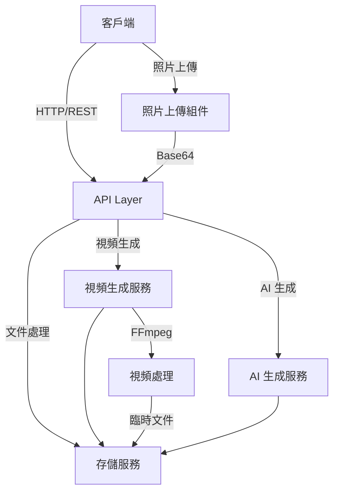

# Travel Echo — 軟體架構與系統設計文件 (SASD)

## 1. 系統概述

### 1.1 系統目標
Travel Echo 是一個 AI 驅動的旅程記憶生成系統，旨在將用戶的旅行照片和文字轉換為精美的回憶視頻。

### 1.2 主要功能
- 照片上傳和處理
- AI 文案生成
- 視頻合成
- 分享功能

### 1.3 開發進度（2024/03）
- [x] 基礎架構搭建
- [x] 照片上傳功能
- [x] 視頻生成核心邏輯
- [ ] AI 文案生成
- [ ] 社交分享功能

## 2. 系統架構

### 2.1 整體架構


### 2.2 技術棧
- **前端**：Next.js, React, Material-UI
- **後端**：Next.js API Routes
- **視頻處理**：FFmpeg
- **存儲**：本地文件系統
- **AI 服務**：OpenAI API

### 2.3 已實現的核心功能
- 照片上傳與預覽
- Base64 轉換與傳輸
- FFmpeg 視頻生成
- 錯誤處理機制

## 3. 詳細設計

### 3.1 前端架構
#### 3.1.1 核心組件
- `VideoPlayer`: 視頻播放和生成控制
  - 狀態管理：生成進度、錯誤處理
  - 視頻預覽功能
- `PhotoUpload`: 照片上傳和預覽
  - Blob URL 處理
  - Base64 轉換
- `TextGeneration`: 文字生成和編輯（待實現）
- `ProgressIndicator`: 進度顯示

#### 3.1.2 狀態管理
使用 React Context API 進行全局狀態管理：
```typescript
interface DemoContext {
    photos: string[];
    text: string;
    setPhotos: (photos: string[]) => void;
    setText: (text: string) => void;
    clearAll: () => void;
}
```

### 3.2 後端架構
#### 3.2.1 API 端點
- `/api/generate`: 視頻生成
  - 輸入：照片數據（Base64）、文字內容
  - 輸出：視頻 URL
- `/api/upload`: 照片上傳（待實現）
- `/api/text`: 文字生成（待實現）

#### 3.2.2 服務層
- `VideoGenerator`: 視頻處理核心類
  ```typescript
  class VideoGenerator {
      private readonly STORAGE_DIR: string;
      private readonly VIDEO_DIR: string;
      private readonly TEMP_DIR: string;

      async generateVideo(options: VideoGeneratorOptions): Promise<string> {
          // 1. 處理輸入的照片數據
          // 2. 創建字幕文件
          // 3. 使用 FFmpeg 生成視頻
          // 4. 清理臨時文件
      }
  }
  ```

### 3.3 已知技術挑戰和解決方案
1. **照片數據傳輸**
   - 問題：Blob URL 只在前端有效
   - 解決：實現 Base64 轉換機制

2. **視頻生成效能**
   - 問題：FFmpeg 處理時間較長
   - 解決：添加進度回饋機制

3. **臨時文件管理**
   - 問題：需要妥善處理臨時文件
   - 解決：實現自動清理機制

## 4. 下一階段開發重點

### 4.1 待實現功能
1. AI 文案生成
   - OpenAI API 整合
   - 多樣化文案模板

2. 社交分享功能
   - 分享鏈接生成
   - 預覽圖生成

### 4.2 技術優化
1. 效能改進
   - 視頻生成速度優化
   - 內存使用優化

2. 錯誤處理
   - 更完善的錯誤提示
   - 自動重試機制

## 5. 安全性設計

### 5.1 文件安全
- [x] 使用唯一文件名
- [x] 限制上傳文件大小和類型
- [x] 定期清理臨時文件

### 5.2 API 安全
- [ ] 請求速率限制
- [x] 文件類型驗證
- [x] 錯誤處理和日誌記錄

## 6. 當前系統限制

### 6.1 已知限制
1. 本地存儲
   - 暫時使用本地文件系統
   - 需要考慮遷移到雲存儲

2. 視頻處理
   - 單機處理能力有限
   - 需要考慮分布式處理

### 6.2 擴展建議
1. 短期優化
   - 優化 FFmpeg 參數
   - 改進錯誤處理機制

2. 長期規劃
   - 引入雲服務
   - 實現分布式處理

## 7. 擴展性考慮

### 7.1 水平擴展
- 模塊化設計
- 服務解耦
- 異步處理

### 7.2 未來擴展點
- 雲存儲整合
- 視頻模板系統
- 社交媒體分享
- 用戶認證系統

## 8. 監控和維護

### 8.1 性能監控
- 視頻生成時間
- API 響應時間
- 存儲使用情況

### 8.2 錯誤處理
- 全局錯誤捕獲
- 錯誤日誌記錄
- 用戶友好錯誤提示

## 9. 部署策略

### 9.1 開發環境
- 本地開發環境
- 測試環境配置
- CI/CD 流程

### 9.2 生產環境
- 服務器要求
- 環境變量配置
- 部署檢查清單

## 10. 技術債務和優化計劃

### 10.1 當前技術債務
- 錯誤處理優化
- 性能優化
- 代碼重構需求

### 10.2 優化計劃
1. 短期（1-2週）
   - 完善錯誤處理
   - 優化視頻生成效能
   - 改進文件處理流程

2. 中期（1個月）
   - 實現模板系統
   - 添加社交分享
   - 優化用戶體驗

3. 長期（3個月）
   - 雲端整合
   - 擴展 AI 功能
   - 建立監控系統 